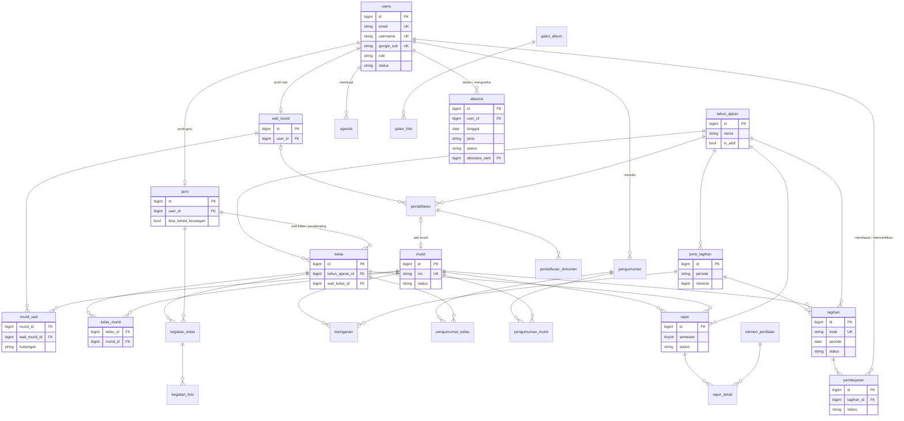
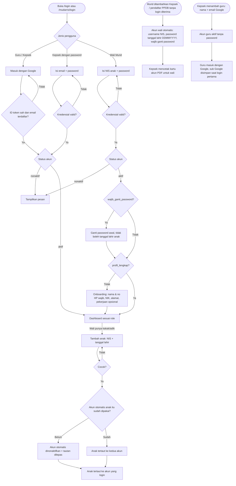
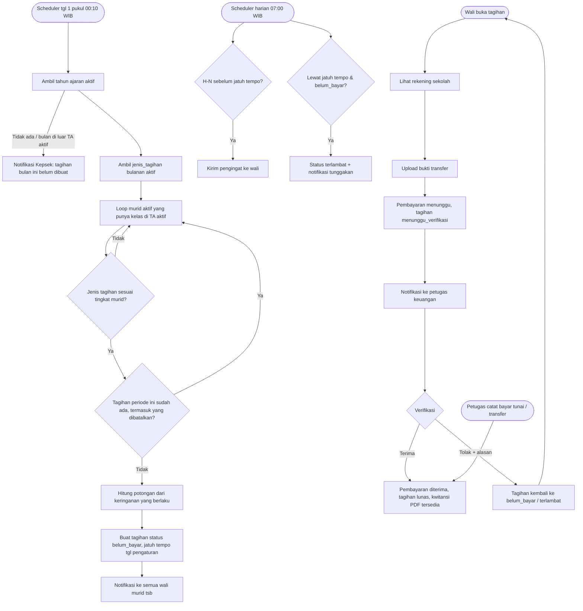
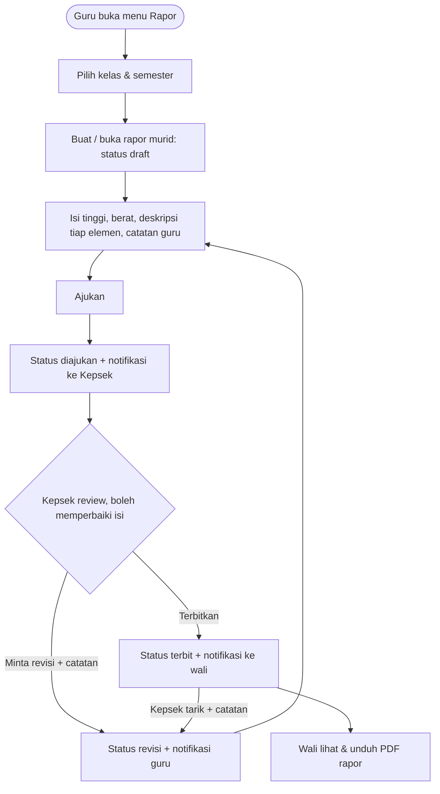
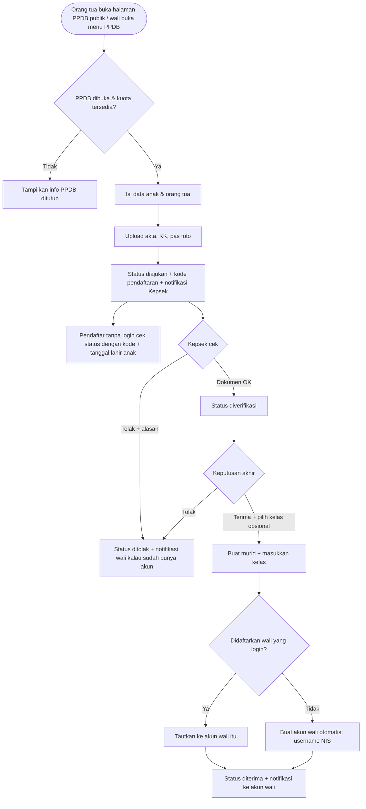
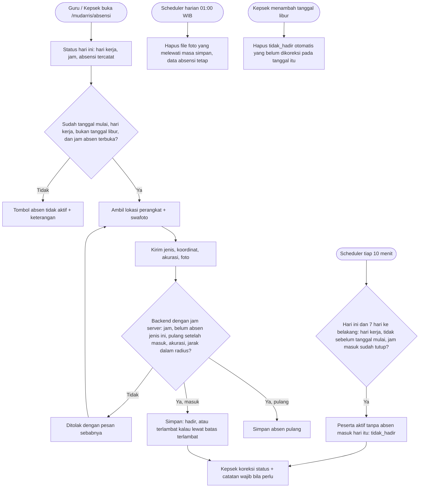

# PROMPT BACKEND — Sistem Informasi TK Tarbiyathul Athfal 8

Kamu adalah senior Laravel engineer. Tugasmu membangun **REST API** untuk sistem informasi sekolah TK Tarbiyathul Athfal 8 di repo `BE_TK_Tarbiyathul_athfal_8`, dari nol, sesuai desain final di Bagian A. Frontend (repo terpisah, Next.js) dan nanti aplikasi Flutter akan memakai API ini, jadi **kontrak API di A7 wajib diikuti persis** (path, nama field, enum, format respons).

## Aturan kerja (WAJIB)

1. **Fase 0 dulu, tanpa menulis kode.** Baca seluruh prompt, cek versi Laravel/PHP/paket yang tersedia sekarang, lalu tulis rencana (urutan migration, daftar paket + kompatibilitasnya, struktur folder, risiko). Tampilkan rencana + pertanyaan (kalau ada), lalu **tunggu konfirmasiku**.
2. Kerjakan **per fase** (Bagian D). Di akhir tiap fase: jalankan `php artisan test`, `./vendor/bin/pint`, `./vendor/bin/phpstan analyse`, `composer check:slop`, pastikan hijau, review ulang kodemu terhadap checklist Bagian C (anti AI-slop), update `dokumentasi.md`, lalu **berhenti dan laporkan** (apa yang dibuat, cara uji, hal yang perlu keputusanku). Jangan lompat ke fase berikutnya tanpa konfirmasi.
3. Tulis **file lengkap**, jangan potongan/diff parsial, jangan ada `// TODO` kosong atau placeholder yang tidak jalan.
4. Kalau ada yang ambigu atau bertentangan dengan desain, **tanyakan**. Jangan mengubah skema/kontrak diam-diam. Kalau kamu yakin ada desain yang perlu diubah, usulkan dulu dengan alasannya.
5. Semua pesan untuk pengguna (validasi, error, notifikasi) dalam **Bahasa Indonesia**. Nama kode (class, method, variabel) boleh campuran sesuai istilah domain di desain (contoh: `TagihanService`, `generateBulanan()`).

## `dokumentasi.md` (WAJIB)

Buat di root repo sejak Fase 1, dan selalu diperbarui. Isinya:
- Ringkasan proyek, stack + versi terpasang, cara install & menjalankan (termasuk queue & scheduler)
- Daftar variabel `.env` penting
- **Changelog per fase**: setiap file baru dan file lama yang diubah, beserta alasan singkat
- Keputusan teknis yang diambil selama pengerjaan
- Status: fase selesai, sedang dikerjakan, dan yang tersisa
- Akun seed untuk testing

Dokumen ini jadi acuan saat aku meminta prompt lanjutan, jadi harus akurat.
---

# BAGIAN A — DESAIN SISTEM (FINAL, JANGAN DIUBAH TANPA KONFIRMASI)

> Bagian ini sama persis di prompt FE dan BE. Ini acuan tunggal. Kalau kamu (agent) menemukan konflik atau hal yang tidak masuk akal, **tanyakan dulu**, jangan mengarang sendiri.

## A1. Ringkasan Sistem

Sistem Informasi Sekolah **TK Tarbiyathul Athfal 8** berbasis web (dan nanti mobile Flutter memakai API yang sama).

- **2 repo terpisah:**
  - `BE_TK_Tarbiyathul_athfal_8` → Laravel (REST API, token Sanctum, dokumentasi OpenAPI via Scramble)
  - `FE_TK_Tarbiyathul_athfal_8` → Next.js (App Router) + TypeScript + Tailwind CSS + shadcn/ui
- **3 role:**
  | Role (kode) | Siapa | Level |
  |---|---|---|
  | `super_admin` | Kepala Sekolah | Super Admin |
  | `guru` | Guru | Admin |
  | `wali_murid` | Orang tua / wali | User |
- **Murid TIDAK punya akun login.** Murid hanya data. Semua akses anak lewat akun wali murid (1 wali bisa punya beberapa anak, 1 anak bisa punya beberapa wali, misal ayah & ibu).
- **Absensi hanya untuk guru aktif dan Kepala Sekolah** (berbasis lokasi dan foto, lihat A2.12). Tidak ada absensi murid.
- **Dua area dashboard terpisah**: wali murid di `/dashboard/...`, guru dan Kepala Sekolah di `/mudarris/...` (termasuk halaman akun: `/mudarris/login`, serta `/mudarris/lupa-password` dan `/mudarris/reset-password` khusus Kepala Sekolah). Di dalam `/mudarris`, menu, isi beranda, dan aksi menyesuaikan role (Kepala Sekolah, guru, petugas keuangan).
- **Hanya super admin** yang bisa mengubah konten website publik (landing page, profil sekolah, galeri) dan pengaturan sistem.

## A2. Keputusan Desain Penting

1. **Login:**
   - Guru dan Kepala Sekolah → akun Google (Google Identity Services) dengan email yang sudah didaftarkan. Kepala Sekolah juga bisa login dengan email + password sebagai cadangan; guru tidak punya password.
   - Wali Murid → NIS anak (sebagai username) + password. Wali tidak mendaftar sendiri dan tidak punya email. Akun wali dibuat otomatis saat murid ditambahkan Kepala Sekolah atau pendaftaran PPDB diterima, kalau murid itu belum tertaut ke akun wali mana pun: role `wali_murid`, username = NIS murid, password awal = tanggal lahir anak (format DDMMYYYY), `wajib_ganti_password = true`, nama sementara "Wali <nama panggilan anak>", tertaut sebagai kontak utama (hubungan dari formulir PPDB, atau `wali` untuk murid yang ditambahkan Kepala Sekolah). Pendaftaran PPDB yang diajukan wali yang sudah login ditautkan ke akun wali itu, tanpa akun baru. Sekolah membagikan kartu akun (PDF) berisi NIS, tanpa password.
   - Selama `wajib_ganti_password = true`, akun wali hanya bisa membuka `GET /auth/me`, `PUT /auth/password`, dan `POST /auth/logout`. Password baru tidak boleh sama dengan tanggal lahir anak. Setelah itu wali melengkapi profil (onboarding). Wali yang lupa password meminta Kepala Sekolah mengembalikannya ke password awal.
   - Akun Kepala Sekolah dibuat lewat seeder (hanya 1 akun `super_admin` aktif), sekaligus profil `guru` miliknya (jabatan "Kepala Sekolah") supaya Kepala Sekolah bisa mencatat kegiatan kelas, menjadi wali kelas bila perlu, dan tampil di daftar guru landing. Profil guru ini tidak muncul di `GET /guru`, tidak bisa dinonaktifkan, izin keuangannya tidak bisa diubah, dan tidak dihitung sebagai guru di statistik dashboard; profil ini tetap bisa dibuka dan diubah lewat `GET/PUT /guru/{id}`.
   - Tidak ada pendaftaran guru mandiri. Kepala Sekolah membuat akun guru dengan nama dan email Google (unik tanpa membedakan huruf besar, disimpan huruf kecil); akun langsung `aktif`. Login Google tidak pernah membuat akun: email yang tidak terdaftar ditolak. `sub` akun Google disimpan saat login pertama dan login berikutnya harus dari akun Google yang sama; mengganti email guru melepas ikatan itu. Guru tidak dihapus, hanya dinonaktifkan, supaya riwayat datanya tetap utuh; akun nonaktif tidak bisa login.
2. **Menautkan anak ke wali:** setiap murid punya akun wali otomatis (A2.1). Wali yang sudah login menambahkan kakak/adik ke akunnya dengan NIS + tanggal lahir anak. Kalau akun otomatis anak itu belum pernah dipakai (password awal belum diganti), akun itu dinonaktifkan dan tautannya dilepas; kalau sudah dipakai, anak tetap tertaut ke akun itu dan ke akun yang menambahkannya (1 anak boleh punya beberapa akun wali, misal ayah & ibu). Super admin bisa melepas tautan.
3. **PPDB online:** orang tua mendaftarkan anak baru lewat halaman PPDB publik tanpa login saat PPDB dibuka, lalu memantau status dengan kode pendaftaran + tanggal lahir anak. Wali yang sudah punya akun juga bisa mendaftarkan kakak/adik lewat dashboard. Pendaftaran selalu untuk tahun ajaran di pengaturan `ppdb.tahun_ajaran_id` (biasanya tahun ajaran berikutnya, bukan yang sedang aktif). PPDB tidak bisa dibuka (`ppdb.dibuka = true` ditolak) kalau `ppdb.tahun_ajaran_id` belum diisi atau tahun ajarannya tidak ada. Kalau diterima, sistem otomatis membuat data murid lalu menautkannya ke wali pendaftar yang login, atau membuatkan akun wali otomatis (A2.1) untuk pendaftar tanpa login.
4. **Tagihan (SPP) otomatis:** scheduler membuat tagihan bulanan tiap tanggal 1 untuk semua murid aktif, berdasarkan `jenis_tagihan` berperiode `bulanan` yang aktif di tahun ajaran aktif. Idempoten (tidak dobel, dijaga unique index); tagihan yang `dibatalkan` tetap dihitung sudah ada, jadi pembatalan dihormati dan tagihan itu hanya bisa dipulihkan Kepala Sekolah lewat aktifkan kembali. Potongan dari tabel `keringanan` otomatis diterapkan. Petugas keuangan bisa mengubah jatuh tempo, potongan, dan catatan tagihan yang belum dibayar.
5. **Pembayaran:** transfer manual ke rekening sekolah + upload bukti oleh wali → diverifikasi. Petugas keuangan juga bisa mencatat pembayaran tunai, atau transfer yang sudah masuk ke rekening sekolah (bukti opsional); keduanya otomatis diterima. **Tidak ada cicilan** (1 tagihan dibayar penuh). Payment gateway (Midtrans) = pengembangan nanti, bukan sekarang.
6. **Petugas keuangan:** super admin, ditambah guru yang diberi izin `bisa_kelola_keuangan = true` oleh super admin (untuk guru yang merangkap bendahara).
7. **Tunggakan:** tagihan lewat jatuh tempo otomatis berstatus `terlambat` dan wali dapat notifikasi. Super admin/guru juga bisa membuat pengumuman dengan target `murid` tertentu (misal yang menunggak).
8. **Rapor perkembangan anak (Kurikulum Merdeka PAUD):** penilaian naratif per elemen. Elemen bisa dikelola super admin (seed awal: Nilai Agama & Budi Pekerti; Jati Diri; Dasar-dasar Literasi, Matematika, Sains, Teknologi, Rekayasa & Seni). Alur: guru draft → ajukan → kepala sekolah terbitkan atau minta revisi (kepala sekolah boleh memperbaiki isi rapor yang sedang diajukan) → wali bisa lihat & unduh PDF. Rapor terbit bisa ditarik kepala sekolah kembali ke revisi dengan catatan.
9. **Privasi foto anak:** foto kegiatan kelas, bukti bayar, dokumen PPDB, dan foto rapor disimpan di disk **private**, diakses via endpoint terotorisasi / signed URL. Hanya galeri publik & aset landing yang di disk public.
10. **Uang** disimpan sebagai integer rupiah (tanpa desimal). **Zona waktu** `Asia/Jakarta`, bahasa `id`.
11. **Notifikasi** memakai Laravel database notifications (channel mail opsional). Push notification (FCM) nanti saat Flutter.
12. **Absensi guru dan Kepala Sekolah:** peserta absensi adalah guru yang akunnya `aktif` dan Kepala Sekolah. Guru nonaktif tidak ikut absensi dan tidak ditandai tidak hadir. Absen masuk dan absen pulang dilakukan dari HP di `/mudarris/absensi` dengan lokasi perangkat dan swafoto. Semua keputusan diambil backend dengan jam server (`Asia/Jakarta`): hari ini tidak sebelum tanggal mulai absensi, hari kerja dan bukan tanggal libur, di dalam jam jenis absen itu, jarak ke titik sekolah (Haversine) tidak melebihi radius, akurasi lokasi tidak melebihi batas, belum absen jenis itu hari ini, dan absen pulang hanya setelah absen masuk. Jarak yang ditampilkan FE hanya informasi. Status absen masuk `hadir` atau `terlambat` menurut batas terlambat; absen pulang tidak punya status. Setelah jam masuk tutup di hari kerja, scheduler menandai peserta yang belum absen masuk sebagai `tidak_hadir`, termasuk susulan hari kerja yang terlewat sampai 7 hari ke belakang, tetapi tidak pernah untuk tanggal sebelum tanggal mulai absensi. Kalau Kepala Sekolah menambahkan tanggal libur, tanda `tidak_hadir` buatan scheduler yang belum dikoreksi pada tanggal itu dihapus; absen sungguhan dan baris yang sudah dikoreksi tetap. Kepala Sekolah bisa mengoreksi status absen masuk dengan catatan wajib; pengoreksi dan waktunya dicatat. Foto absensi disimpan di disk private, hanya bisa dibuka pemiliknya dan Kepala Sekolah, dan file-nya dihapus setelah masa simpan (data absensinya tetap). Aturan absensi (titik sekolah, radius, batas akurasi, jam, hari kerja, tanggal libur, tanggal mulai, masa simpan foto) diatur Kepala Sekolah di pengaturan grup `absensi`.

## A3. Use Case per Aktor

**Publik (tanpa login)**
- Melihat landing page (profil, visi-misi, program, fasilitas, guru, galeri, pengumuman publik, agenda publik, info PPDB, kontak)
- Melihat daftar & detail pengumuman publik, galeri
- Daftar PPDB tanpa login & cek status pendaftaran dengan kode pendaftaran + tanggal lahir anak
- Login (guru dan Kepala Sekolah dengan Google, Kepala Sekolah juga dengan email + password, wali murid dengan NIS anak), lupa/reset password (Kepala Sekolah)

**Wali Murid (User)**
- Login dengan NIS anak + password, ganti password awal saat login pertama, lengkapi profil (onboarding)
- Tambah kakak/adik dengan NIS + tanggal lahir anak; lihat daftar anak; pindah anak aktif (switcher)
- Beranda: info sekolah (banner dari Kepala Sekolah), ringkasan tagihan, kegiatan kelas terbaru, pengumuman, agenda, rapor terbaru
- Lihat tagihan anak, bayar (upload bukti transfer), lihat riwayat pembayaran, unduh kwitansi
- Lihat kegiatan/dokumentasi kelas anak (foto)
- Lihat & unduh rapor yang sudah terbit
- Lihat pengumuman yang relevan (semua / wali / kelas anak / anaknya)
- Lihat agenda sekolah
- Daftar PPDB untuk kakak/adik & pantau statusnya
- Notifikasi, edit profil (nama, nomor HP, alamat, pekerjaan, NIK), ganti password

**Guru (Admin)**
- Login dengan akun Google yang emailnya didaftarkan Kepala Sekolah
- Beranda: kelas saya, jumlah murid, progres rapor, kegiatan terakhir, pengumuman
- Kelas saya: daftar murid kelas yang diampu (sebagai wali kelas / pendamping), detail murid & kontak wali
- Kelola kegiatan kelas (judul, tema, deskripsi, foto beserta keterangan dan urutannya)
- Kelola rapor murid kelasnya (draft, isi per elemen, ajukan, perbaiki saat revisi)
- Buat pengumuman untuk kelasnya / murid di kelasnya
- Lihat status tagihan murid kelasnya (read-only)
- Lihat agenda
- **Jika `bisa_kelola_keuangan`**: akses menu keuangan seperti super admin (kecuali pengaturan rekening & jenis tagihan)
- Absen masuk dan absen pulang dengan lokasi dan foto, lihat status hari ini dan riwayat absensinya sendiri
- Notifikasi, edit profil

**Kepala Sekolah (Super Admin)**
- Semua yang bisa guru lakukan (lihat semua kelas)
- Beranda: statistik sekolah + daftar tindakan tertunda (pembayaran menunggu verifikasi, rapor menunggu review, pendaftar PPDB baru)
- Kelola guru: tambah (nama + email Google), edit, aktif/nonaktifkan (tanpa hapus), beri izin keuangan, tampilkan di landing
- Kelola tahun ajaran (aktifkan 1), kelas (wali kelas, pendamping, kapasitas), penempatan murid, kenaikan kelas massal
- Kelola murid (CRUD, status, unduh kartu akun wali, ubah hubungan & kontak utama wali, lepas tautan wali), lihat & ubah data wali murid, reset password wali murid
- Keuangan: jenis tagihan, keringanan, generate tagihan manual (idempoten), tagihan sekali bayar (uang pangkal/seragam), ubah jatuh tempo/potongan/catatan tagihan, verifikasi pembayaran, catat pembayaran tunai/transfer, batalkan tagihan dan aktifkan kembali, laporan & ekspor Excel, daftar tunggakan
- Rapor: review, perbaiki isi sebelum terbit, terbitkan, minta revisi, tarik rapor terbit; kelola elemen penilaian
- Pengumuman (semua target) & agenda
- PPDB: buka/tutup, verifikasi, terima (pilih kelas), tolak
- **CMS website:** profil sekolah, konten landing, galeri
- Pengaturan: rekening sekolah, tanggal jatuh tempo, hari pengingat, info PPDB, banner info di beranda wali murid
- Absensi: ikut absen seperti guru; atur titik sekolah, radius, batas akurasi, jam masuk dan pulang, hari kerja, tanggal libur, tanggal mulai absensi, dan masa simpan foto; koreksi status absensi dengan catatan; rekap per bulan per peserta, detail per hari dengan foto, dan ekspor CSV
- Log aktivitas

## A4. ERD



### Detail tabel

Semua tabel punya `id` (bigint PK) dan `created_at/updated_at` kecuali pivot yang disebut. Nama tabel bahasa Indonesia → set `$table` eksplisit di model.

- **users**: name, email (nullable unique, disimpan huruf kecil; wali murid tidak punya email), username (nullable unique; NIS anak untuk wali murid, kosong untuk guru dan Kepala Sekolah), password (nullable; guru tidak punya password), google_sub (nullable unique; `sub` akun Google guru/Kepala Sekolah, diisi saat login Google pertama), wajib_ganti_password (bool, default false; true selama wali memakai password awal), role (enum Role), status (enum StatusAkun), no_hp (nullable), avatar_path (nullable), email_verified_at, last_login_at, remember_token, deleted_at (soft delete)
- **guru**: user_id (FK unique), nip (nullable), nuptk (nullable), jenis_kelamin (L/P), tempat_lahir, tanggal_lahir, alamat, pendidikan_terakhir, jabatan (string, misal "Guru Kelas"), foto_path, bisa_kelola_keuangan (bool, default false), tampil_di_landing (bool, default false)
- **wali_murid**: user_id (FK unique), nik (nullable), pekerjaan, alamat, profil_lengkap (bool, default false)
- **murid**: nis (unique, auto format `TA{tahun}{urut 4 digit}`), nisn (nullable unique), nik (nullable), nama_lengkap, nama_panggilan, jenis_kelamin, tempat_lahir, tanggal_lahir, agama, alamat, anak_ke (nullable), foto_path (nullable), catatan_khusus (nullable, misal alergi makanan / kebutuhan khusus — hanya terlihat guru & kepsek & wali anak itu), status (enum StatusMurid), tanggal_masuk, tanggal_keluar (nullable), deleted_at
- **murid_wali** (pivot): murid_id, wali_murid_id, hubungan (enum Hubungan), is_kontak_utama (bool), created_at. Unique (murid_id, wali_murid_id)
- **tahun_ajaran**: nama ("2026/2027"), tanggal_mulai, tanggal_selesai, semester_aktif (1/2), is_aktif (hanya 1 yang true)
- **kelas**: tahun_ajaran_id, nama ("TK A1"), tingkat (enum Tingkat), wali_kelas_id (FK guru, nullable), guru_pendamping_id (FK guru, nullable), kapasitas (int, default 20)
- **kelas_murid**: kelas_id, murid_id, status (enum StatusKelasMurid, default aktif). Unique (kelas_id, murid_id). Aturan: 1 murid hanya boleh 1 kelas per tahun ajaran (validasi di service)
- **jenis_tagihan**: tahun_ajaran_id, nama ("SPP", "Uang Kegiatan", "Seragam"), deskripsi, nominal (unsigned bigint), periode (enum PeriodeTagihan), tingkat (nullable enum Tingkat; null = semua tingkat), is_aktif
- **keringanan**: murid_id, jenis_tagihan_id, tipe (enum TipeKeringanan), nilai (int; persen 1–100 atau rupiah), alasan, berlaku_mulai (date), berlaku_sampai (date nullable), dibuat_oleh (FK users)
- **tagihan**: kode (unique, `INV-YYYYMM-XXXXX`), murid_id, jenis_tagihan_id, tahun_ajaran_id, periode (date nullable, selalu tanggal 1 bulan tsb; null untuk tagihan sekali), nominal, potongan, total, jatuh_tempo (date), status (enum StatusTagihan), lunas_at (nullable), dibuat_oleh (FK users nullable; null = sistem), catatan. **Unique (murid_id, jenis_tagihan_id, periode)**, termasuk tagihan yang `dibatalkan`: tagihan bulanan yang dibatalkan tidak dibuat ulang, tetapi bisa diaktifkan kembali
- **pembayaran**: kode (unique, `PAY-YYYYMMDD-XXXXX`), tagihan_id, dibayar_oleh (FK users nullable), metode (enum MetodeBayar), jumlah, tanggal_bayar, bukti_path (nullable, private), bank_pengirim (nullable), nama_pengirim (nullable), status (enum StatusPembayaran), alasan_penolakan (nullable), diverifikasi_oleh (FK users nullable), diverifikasi_at. 1 tagihan boleh punya banyak percobaan pembayaran, tapi maksimal 1 yang `menunggu` dan 1 yang `diterima`
- **pengumuman**: judul, slug (unique), isi (HTML, disanitasi), lampiran_path (nullable), target (enum TargetPengumuman), is_publik (bool, tampil di landing; hanya boleh jika target `semua`), is_pinned (bool), penulis_id (FK users), published_at (nullable = draft), deleted_at
- **pengumuman_kelas**: pengumuman_id, kelas_id. **pengumuman_murid**: pengumuman_id, murid_id
- **agenda**: judul, deskripsi, tanggal_mulai, tanggal_selesai, jenis (enum JenisAgenda), is_publik, dibuat_oleh
- **kegiatan_kelas**: kelas_id, guru_id, tanggal, tema, judul, deskripsi. **kegiatan_foto**: kegiatan_kelas_id, path (private), caption, urutan
- **elemen_penilaian**: kode, nama, deskripsi, urutan, is_aktif
- **rapor**: murid_id, kelas_id, tahun_ajaran_id, semester (1/2), tinggi_badan (decimal nullable, cm), berat_badan (decimal nullable, kg), catatan_guru, status (enum StatusRapor), catatan_revisi (nullable), dibuat_oleh (FK guru), diajukan_at, disetujui_oleh (FK users nullable), terbit_at. Unique (murid_id, tahun_ajaran_id, semester)
- **rapor_detail**: rapor_id, elemen_penilaian_id, deskripsi (text), foto_path (nullable, private). Unique (rapor_id, elemen_penilaian_id)
- **pendaftaran**: kode (unique, `PPDB-YYYY-XXXX`), wali_murid_id (nullable; kosong untuk pendaftaran tanpa login, diisi akun wali otomatis saat diterima), hubungan (enum Hubungan; hubungan wali pendaftar dengan anak, dipakai saat menautkan ketika diterima), tahun_ajaran_id (diisi dari `ppdb.tahun_ajaran_id` saat mendaftar), tingkat_tujuan, nama_lengkap, nama_panggilan, jenis_kelamin, tempat_lahir, tanggal_lahir, nik, agama, alamat, nama_ayah, pekerjaan_ayah, nama_ibu, pekerjaan_ibu, no_hp, status (enum StatusPendaftaran), catatan (nullable), diproses_oleh (nullable), diproses_at, murid_id (nullable, terisi saat diterima)
- **pendaftaran_dokumen**: pendaftaran_id, jenis (enum JenisDokumen), path (private)
- **galeri_album**: judul, slug, deskripsi, cover_path, tanggal, is_publik. **galeri_foto**: galeri_album_id, path (public), caption, urutan
- **absensi**: user_id (FK users; guru atau Kepala Sekolah), tanggal (date), jenis (enum JenisAbsensi), status (nullable enum StatusAbsensi; hanya untuk jenis `masuk`), waktu (timestamp nullable, jam server saat absen; null untuk `tidak_hadir` dari scheduler), latitude dan longitude (decimal 10,7 nullable), akurasi_meter (int nullable), jarak_meter (int nullable, jarak ke titik sekolah saat absen), foto_path (nullable, private; dikosongkan saat file dihapus setelah masa simpan), catatan_koreksi (nullable), dikoreksi_oleh (FK users nullable), dikoreksi_at (nullable). **Unique (user_id, tanggal, jenis)**
- **pengaturan**: kunci (unique), nilai (json), grup (string: profil | landing | keuangan | ppdb | beranda | absensi)
- Tabel bawaan: personal_access_tokens, notifications, password_reset_tokens, jobs, failed_jobs, activity_log (spatie)

### Kunci pengaturan (seed default)

| kunci | isi |
|---|---|
| `profil.nama_sekolah` | "TK Tarbiyathul Athfal 8" |
| `profil.npsn`, `profil.alamat`, `profil.telepon`, `profil.email`, `profil.maps_embed_url` | string |
| `profil.logo` | path gambar |
| `profil.visi` | string |
| `profil.misi` | string[] |
| `profil.sejarah`, `profil.sambutan_kepsek` | string (HTML) |
| `landing.hero` | { judul, subjudul, gambar, cta_teks } |
| `landing.program` | { judul, deskripsi, ikon }[] |
| `landing.fasilitas` | { nama, deskripsi, gambar }[] |
| `landing.keunggulan` | { judul, deskripsi, ikon }[] |
| `keuangan.rekening` | { bank, nomor, atas_nama }[] |
| `keuangan.tanggal_jatuh_tempo` | int (default 10) |
| `keuangan.hari_pengingat` | int (default 3, H-3 sebelum jatuh tempo) |
| `ppdb.dibuka` | bool |
| `ppdb.tanggal_buka`, `ppdb.tanggal_tutup` | date |
| `ppdb.tahun_ajaran_id` | int (id tahun ajaran tujuan PPDB; wajib terisi dengan tahun ajaran yang ada sebelum `ppdb.dibuka` bisa `true`) |
| `ppdb.kuota` | int |
| `ppdb.info` | string (HTML: syarat, biaya, alur) |
| `beranda.info_wali` | { aktif: bool, judul: string (maks 100), isi: string (teks biasa, maks 1000), nada: NadaInfo, berlaku_sampai: date \| null }; judul dan isi wajib kalau `aktif`. Default nonaktif |
| `absensi.lokasi` | { latitude, longitude } \| null (default null; selama null semua absen ditolak) |
| `absensi.radius_meter` | int 10–5000 (default 100) |
| `absensi.batas_akurasi_meter` | int 5–1000 (default 100) |
| `absensi.jam_masuk` | { buka, batas_terlambat, tutup } format `HH:MM`, berurutan (default 06:30, 07:15, 09:00) |
| `absensi.jam_pulang` | { buka, tutup } format `HH:MM` (default 11:00, 15:00) |
| `absensi.hari_kerja` | int[] nomor hari ISO, 1 = Senin sampai 7 = Minggu (default 1–6) |
| `absensi.tanggal_libur` | date[] (default kosong) |
| `absensi.masa_simpan_foto_bulan` | int 1–60 (default 6) |
| `absensi.tanggal_mulai` | date (default tanggal migration dijalankan); sebelum tanggal ini absen ditolak dan tidak ada yang ditandai tidak hadir |

## A5. Enum (nilai string, dipakai sama di BE & FE)

- **Role**: `super_admin`, `guru`, `wali_murid`
- **StatusAkun**: `aktif`, `nonaktif`
- **StatusMurid**: `aktif`, `lulus`, `pindah`, `keluar`
- **Hubungan**: `ayah`, `ibu`, `wali`
- **Tingkat**: `A`, `B`
- **StatusKelasMurid**: `aktif`, `naik`, `tinggal`, `lulus`, `keluar`
- **PeriodeTagihan**: `bulanan`, `sekali`
- **TipeKeringanan**: `persen`, `nominal`
- **StatusTagihan**: `belum_bayar`, `menunggu_verifikasi`, `lunas`, `terlambat`, `dibatalkan`
- **MetodeBayar**: `transfer`, `tunai`
- **StatusPembayaran**: `menunggu`, `diterima`, `ditolak`
- **TargetPengumuman**: `semua`, `guru`, `wali_murid`, `kelas`, `murid`
- **JenisAgenda**: `kegiatan`, `libur`, `rapat`, `lainnya`
- **StatusRapor**: `draft`, `diajukan`, `revisi`, `terbit`
- **StatusPendaftaran**: `diajukan`, `diverifikasi`, `diterima`, `ditolak`
- **JenisDokumen**: `akta_kelahiran`, `kartu_keluarga`, `pas_foto`, `lainnya`
- **NadaInfo**: `info`, `penting`, `peringatan`
- **JenisAbsensi**: `masuk`, `pulang`
- **StatusAbsensi**: `hadir`, `terlambat`, `tidak_hadir`

## A6. Flowchart

### Autentikasi & onboarding



### Tagihan bulanan & pembayaran



### Rapor



### PPDB



### Absensi guru dan Kepala Sekolah



## A7. Kontrak API

**Base URL:** `{BE_URL}/api/v1`. Auth: header `Authorization: Bearer {token}` (Sanctum). Semua respons JSON.

**Format respons sukses:**
```json
{ "success": true, "message": "Berhasil", "data": {}, "meta": null }
```
**Respons list berpaginasi** (`?page=1&per_page=15`, default 15, max 100):
```json
{ "success": true, "message": "Berhasil", "data": [], "meta": { "current_page": 1, "per_page": 15, "total": 120, "last_page": 8 } }
```
**Respons error:**
```json
{ "success": false, "message": "Data tidak valid", "code": "VALIDATION_ERROR", "errors": { "email": ["Email wajib diisi."] } }
```
Kode error: `UNAUTHENTICATED` (401), `FORBIDDEN` (403), `ACCOUNT_INACTIVE` (403), `PASSWORD_WAJIB_DIGANTI` (403, akun wali masih memakai password awal; semua endpoint login selain `GET /auth/me`, `PUT /auth/password`, dan `POST /auth/logout`), `NOT_FOUND` (404), `VALIDATION_ERROR` (422), `BUSINESS_RULE` (422, pelanggaran aturan bisnis), `TOO_MANY_REQUESTS` (429), `SERVER_ERROR` (500).

Status HTTP di luar daftar di atas dipetakan ke kode terdekat: 405 (metode HTTP salah) → 404 `NOT_FOUND`; 413 (unggahan melebihi batas server) → 422 `VALIDATION_ERROR` dengan pesan "Ukuran file terlalu besar. Maksimal 5 MB per file."; status 4xx lain → 422 `VALIDATION_ERROR`; 503 (pemeliharaan) → 503 `SERVER_ERROR`. Login Google yang tidak bisa diproses karena `GOOGLE_CLIENT_ID` belum diisi atau kunci publik Google tidak bisa diunduh → 503 `SERVER_ERROR`.

**Bentuk data:** field yang selalu dikirim di sebuah respons ditulis wajib (required) di OpenAPI; yang opsional hanya field yang bergantung role (misalnya `catatan_revisi` rapor, `kelas`/`murid` pengumuman) atau hanya ada di satu respons. Bentuk detail yang berbeda dari bentuk daftar punya skema sendiri (misalnya `TagihanDetailResource` untuk `GET /tagihan/{id}`).

**Konvensi query list:** `?search=`, `?sort=nama` / `?sort=-created_at`, `?filter[status]=aktif`, `?filter[kelas_id]=3`. Filter boolean (misal `filter[dibaca]`) menerima `true`/`false` atau `1`/`0`. Tanggal format `YYYY-MM-DD`, datetime ISO 8601 dengan offset `+07:00`. Uang = integer rupiah.

**File private:** semua `*_url` untuk file private (foto kegiatan, foto murid, foto rapor, bukti bayar, dokumen PPDB) adalah signed URL `GET /media/{token}` yang **bisa langsung dipakai di `` / `<a>` tanpa header Authorization** dan berlaku **30 menit**. Setelah kedaluwarsa, ambil ulang datanya untuk mendapat URL baru. Hak akses dicek saat URL dibuat, jadi URL hanya dikirim ke pengguna yang berhak; siapa pun yang memegang URL bisa membukanya selama masa berlaku.

**Singkatan role:** SA = super_admin, G = guru, K = petugas keuangan (SA atau guru `bisa_kelola_keuangan`), W = wali_murid, Pub = publik.

**Scoping data otomatis:** endpoint yang sama mengembalikan data berbeda per role. G hanya melihat kelas yang dia ampu (wali kelas / pendamping) di TA aktif. W hanya melihat anaknya sendiri. SA melihat semua.

### Publik
- `GET /public/profil` — Pub — semua pengaturan grup profil + landing
- `GET /public/pengumuman` — Pub — pengumuman `is_publik` & terbit, berpaginasi
- `GET /public/pengumuman/{slug}` — Pub
- `GET /public/agenda?bulan=YYYY-MM` — Pub — agenda `is_publik`
- `GET /public/galeri` — Pub — album publik
- `GET /public/galeri/{slug}` — Pub — album + foto
- `GET /public/guru` — Pub — guru aktif `tampil_di_landing` (nama, jabatan, foto)
- `GET /public/ppdb` — Pub — status buka, tanggal, kuota, sisa kuota, info
- `POST /public/pendaftaran` — Pub — multipart, isian dan aturan sama dengan `POST /pendaftaran` (jadwal, kuota, NIK dobel) → 201 `{ kode, status, nama_panggilan, tingkat_tujuan, tahun_ajaran { id, nama }, catatan, diproses_at, created_at }`. Rate limit 3/jam per IP
- `GET /public/pendaftaran/status?kode=&tanggal_lahir=` — Pub — bentuk sama dengan respons `POST /public/pendaftaran` (`catatan` = alasan penolakan); kode atau tanggal lahir tidak cocok → 404 `NOT_FOUND`. Rate limit 10/menit per IP

### Auth
- `POST /auth/staff/login` — Pub — Kepala Sekolah: `{ email, password, perangkat? }` → `{ token, user }` (`user.role` = `super_admin`). Guru tidak punya password dan ditolak dengan balasan yang sama seperti password salah. Rate limit 3/menit per IP+email dan 10/menit per IP
- `POST /auth/staff/google` — Pub — guru dan Kepala Sekolah: `{ credential, perangkat? }` (`credential` = ID token dari Google Identity Services) → `{ token, user }`, bentuk sama dengan login staff (`user.role` = `super_admin` | `guru`, dipakai FE untuk memilih dashboard). BE memverifikasi tanda tangan, `aud` = `GOOGLE_CLIENT_ID`, `iss` Google, `exp`, dan `email_verified = true`; email yang dikirim FE tidak pernah dipakai. Email di token dicocokkan tanpa membedakan huruf besar ke akun guru atau Kepala Sekolah; endpoint ini tidak pernah membuat akun. Token tidak sah, email belum terverifikasi, email tidak terdaftar (selalu pesan yang sama), dan akun Google yang berbeda dari yang pertama kali dipakai → 422 `VALIDATION_ERROR` di field `credential`; akun nonaktif → 403 `ACCOUNT_INACTIVE`. Rate limit 10/menit per IP
- `POST /auth/wali/login` — Pub — wali murid: `{ username, password, perangkat? }` (username = NIS anak, huruf kecil dan spasi dinormalkan) → `{ token, user }` (`user.role` = `wali_murid`). Rate limit 5/menit per IP+username dan 20/menit per IP. Akun dengan `wajib_ganti_password = true` tetap mendapat token
- Akun yang tidak terdaftar, password salah, dan akun dengan role yang bukan milik endpoint itu mendapat balasan 422 yang sama persis (staff: "Email atau password salah." di field `email`; wali: "NIS atau password salah." di field `username`). Status akun dicek setelah password benar. Balasan 429 membawa header `Retry-After` (detik).
- `perangkat`: `web` | `mobile`, opsional, default `web`; dipakai sebagai nama token Sanctum.
- `POST /auth/forgot-password` — Pub — `{ email }` (hanya Kepala Sekolah; guru login lewat Google, wali meminta reset ke sekolah). Email berisi tautan ke halaman FE `/mudarris/reset-password?token=&email=`
- `POST /auth/reset-password` — Pub — `{ token, email, password, password_confirmation }` (hanya Kepala Sekolah)
- `GET /auth/me` — semua — user + profil (guru/wali) + untuk W: daftar anak ringkas
- `POST /auth/logout` — semua
- `PUT /auth/profil` — semua — multipart (avatar opsional)
- `PUT /auth/password` — SA, W — `{ current_password, password, password_confirmation }`. Guru tidak punya password (403 `FORBIDDEN`). Untuk W, password baru tidak boleh sama dengan tanggal lahir anak mana pun (DDMMYYYY); setelah berhasil `wajib_ganti_password = false`

**Bentuk `user` di respons auth:**
```json
{
  "id": 1, "name": "…", "email": "…", "username": null, "role": "guru", "status": "aktif",
  "wajib_ganti_password": false, "no_hp": "…", "avatar_url": "…",
  "guru": { "id": 3, "bisa_kelola_keuangan": false, "kelas_diampu": [{ "id": 2, "nama": "TK A1" }] },
  "wali_murid": null,
  "permissions": { "kelola_keuangan": false }
}
```
Untuk W: `"email": null`, `"username": "TA20260001"` (NIS anak), `wajib_ganti_password` sesuai akun, dan `"wali_murid": { "id": 5, "profil_lengkap": true, "nik": "…" | null, "alamat": "…" | null, "pekerjaan": "…" | null, "anak": [{ "id": 9, "nama_panggilan": "…", "kelas": "TK B2", "foto_url": "…" }] }`.

### Dashboard
- `GET /dashboard` — semua — payload sesuai role; W bisa kirim `?murid_id=`
  - SA: `{ statistik: { murid_aktif, guru_aktif, kelas, wali_murid }, keuangan_bulan_ini: { total_tagihan, terbayar, belum_terbayar, persen_lunas }, grafik_pemasukan: [{ bulan: "2026-01", total }] (12 bulan), tertunda: { pembayaran_menunggu, rapor_diajukan, pendaftaran_baru }, pengumuman_terbaru[], agenda_mendatang[] }`. `guru_aktif` tidak menghitung profil guru milik Kepala Sekolah.
  - G: `{ kelas_saya[] (id, nama, jumlah_murid), progres_rapor: { total, draft, diajukan, revisi, terbit }, kegiatan_terbaru[], pengumuman_terbaru[], agenda_mendatang[], keuangan_kelas: { lunas, belum }, pembayaran_menunggu }`. `pembayaran_menunggu` = jumlah pembayaran berstatus `menunggu` (int) untuk guru `bisa_kelola_keuangan`, `null` untuk guru lain.
  - W: `{ anak: {…}, tagihan_aktif[] , total_belum_bayar, kegiatan_terbaru[], pengumuman_terbaru[], agenda_mendatang[], rapor_terbaru, info_sekolah }`. `info_sekolah` = `{ judul, isi, nada, berlaku_sampai }` dari pengaturan `beranda.info_wali`, atau `null` kalau tidak aktif atau sudah lewat `berlaku_sampai` (tanggal itu sendiri masih tampil)

### Guru (manajemen)
- `GET /guru` — SA — filter status (`aktif` | `nonaktif`), search. Tidak termasuk profil guru milik Kepala Sekolah
- `GET /guru/{id}` — SA — termasuk profil guru milik Kepala Sekolah. Data guru memuat `terhubung_google` (bool: sudah pernah masuk dengan Google); nilai `sub` Google tidak pernah dikirim
- `POST /guru` — SA — `{ name, email, no_hp, jenis_kelamin, nip?, nuptk?, tempat_lahir?, tanggal_lahir?, alamat?, pendidikan_terakhir?, jabatan?, bisa_kelola_keuangan?, tampil_di_landing?, foto? }` → 201, data guru. Akun langsung aktif tanpa password. `email` = email akun Google guru, disimpan huruf kecil dan unik tanpa membedakan huruf besar; guru login lewat `POST /auth/staff/google`
- `PUT /guru/{id}` — SA — termasuk `bisa_kelola_keuangan`, `tampil_di_landing`. Mengganti `email` melepas akun Google yang sudah terikat. Untuk profil guru milik Kepala Sekolah, mengubah `bisa_kelola_keuangan` ditolak (422 `BUSINESS_RULE`)
- `PATCH /guru/{id}/status` — SA — `{ status: aktif|nonaktif }` (nonaktif = cabut semua token dan login ditolak `ACCOUNT_INACTIVE`). Guru tidak bisa dihapus; tidak ada `DELETE /guru/{id}`. Ditolak untuk profil guru milik Kepala Sekolah (422 `BUSINESS_RULE`)
- `POST /guru/{id}/reset-google` — SA — mengosongkan akun Google yang terikat (`google_sub`) supaya guru bisa masuk dengan akun Google baru beremail sama → data guru. Semua token guru itu dicabut (token lama dibalas 401). Ditolak (422 `BUSINESS_RULE`) kalau guru belum pernah masuk dengan Google

### Tahun ajaran & kelas
- `GET|POST /tahun-ajaran`, `PUT|DELETE /tahun-ajaran/{id}` — SA (GET: SA, G)
- `POST /tahun-ajaran/{id}/aktifkan` — SA — menonaktifkan yang lain
- `GET /kelas?filter[tahun_ajaran_id]=` — SA, G(scoped)
- `POST /kelas`, `PUT|DELETE /kelas/{id}` — SA
- `GET /kelas/{id}` — SA, G(scoped) — detail + murid
- `POST /kelas/{id}/murid` — SA — `{ murid_ids: [] }` (cek kapasitas & 1 kelas per TA)
- `DELETE /kelas/{id}/murid/{murid_id}` — SA
- `POST /kelas/kenaikan` — SA — `{ tahun_ajaran_tujuan_id, penempatan: [{ murid_id, kelas_tujuan_id | null, status: naik|tinggal|lulus }] }`

### Murid & wali
- `GET /murid` — SA, G(scoped), W(anak sendiri) — filter kelas_id, status, tingkat, search
- `GET /murid/{id}` — SA, G(scoped), W(anak sendiri) — detail + kelas aktif + wali
- `POST /murid`, `PUT /murid/{id}`, `DELETE /murid/{id}` — SA (multipart foto). `POST /murid` membuat akun wali otomatis (A2.1, hubungan `wali`, kontak utama) yang langsung muncul di `wali` detail murid. `DELETE /murid/{id}` menonaktifkan akun otomatis murid itu kalau belum pernah dipakai
- `GET /murid/{id}/kartu-akun` — SA — PDF A6: kop sekolah, nama anak, kelas, NIS sebagai username, keterangan "Password awal: tanggal lahir anak (DDMMYYYY), wajib diganti saat login pertama", alamat login website. Tanpa password. Ditolak (422 `BUSINESS_RULE`) kalau tidak ada akun wali aktif dengan username NIS itu
- Wali di detail murid: `wali: [{ id, nama, email (null untuk wali), username, no_hp, hubungan, is_kontak_utama, tertaut_at }]`
- `PATCH /murid/{id}/wali/{wali_murid_id}` — SA — `{ hubungan?, is_kontak_utama? }` (minimal satu) → detail murid. Tepat satu kontak utama per murid: `is_kontak_utama: true` memindahkan kontak utama ke wali ini; `false` untuk kontak utama ditolak (422 `BUSINESS_RULE`), pilih wali lain sebagai kontak utama
- `DELETE /murid/{id}/wali/{wali_murid_id}` — SA — lepas tautan
- `GET /wali-murid` — SA — search, dengan jumlah anak
- `GET /wali-murid/{id}` — SA
- `PUT /wali-murid/{id}` — SA — `{ nama?, no_hp?, nik?, alamat?, pekerjaan? }`, boleh sebagian; username tidak bisa diubah. `profil_lengkap` dihitung ulang
- `PATCH /wali-murid/{id}/status` — SA — aktif / nonaktif
- `POST /wali-murid/{id}/reset-password` — SA — password kembali ke tanggal lahir anak yang wali ini jadi kontak utamanya (anak yang NIS-nya = username didahulukan), `wajib_ganti_password = true`, semua token dicabut → bentuk daftar wali murid. Ditolak (422 `BUSINESS_RULE`) kalau wali bukan kontak utama anak mana pun
- `GET /wali-murid` `search` juga mencari username. `user` di data wali murid memuat `username` dan `wajib_ganti_password`
- `PUT /wali/profil` — W — onboarding dan ubah profil `{ nama, no_hp, nik?, alamat?, pekerjaan? }`: `nama` dan `no_hp` wajib; field opsional yang tidak dikirim tidak berubah, `null` mengosongkan → `user` bentuk auth. `profil_lengkap = true` setelah no_hp, alamat, dan pekerjaan terisi
- `POST /wali/tambah-anak` — W — `{ nis, tanggal_lahir, hubungan }` → data anak (bentuk `GET /wali/anak`). NIS atau tanggal lahir tidak cocok → 422 `VALIDATION_ERROR` di field `nis` dengan satu pesan yang sama; anak sudah tertaut atau tidak aktif → 422 `BUSINESS_RULE`. Akun otomatis anak itu yang belum dipakai dinonaktifkan dan tautannya dilepas. Wali ini menjadi kontak utama kalau anak tidak punya wali lain. Rate limit 5/menit per user
- `GET /wali/anak` — W

### Keuangan
- `GET|POST /jenis-tagihan`, `PUT|DELETE /jenis-tagihan/{id}` — SA (GET: K)
- `GET|POST /keringanan`, `PUT|DELETE /keringanan/{id}` — K
- `GET /tagihan` — K, G(scoped, read-only), W(anak sendiri) — filter status, periode (YYYY-MM), kelas_id, murid_id, jenis_tagihan_id
- `GET /tagihan/{id}` — K, G(scoped), W(anak sendiri) — termasuk riwayat pembayaran + rekening sekolah
- `POST /tagihan` — K — tagihan sekali: `{ jenis_tagihan_id, murid_ids?: [], kelas_id?: , jatuh_tempo }` → `{ dibuat, dilewati }`. Murid yang sudah punya tagihan jenis itu (selain `dibatalkan`) dilewati
- `PUT /tagihan/{id}` — K — `{ jatuh_tempo?, potongan?, catatan? }`, boleh sebagian. `total = nominal - potongan` dihitung ulang; potongan maksimal nominal (total 0 → langsung `lunas`); jatuh tempo yang diubah tidak boleh sebelum hari ini, dan tagihan `terlambat` yang jatuh temponya dimundurkan kembali `belum_bayar`. Ditolak (422 `BUSINESS_RULE`) kalau tagihan `lunas`, `dibatalkan`, atau ada pembayaran `menunggu`
- `POST /tagihan/generate` — SA — `{ periode: "YYYY-MM" }` → `{ dibuat, dilewati }` (idempoten; murid yang sudah punya tagihan jenis itu di periode itu dilewati, termasuk yang `dibatalkan`)
- `PATCH /tagihan/{id}/batalkan` — SA — `{ alasan }`
- `POST /tagihan/{id}/aktifkan` — SA — tagihan `dibatalkan` kembali ke `belum_bayar`, atau `terlambat` kalau jatuh temponya sudah lewat → tagihan. Ditolak (422 `BUSINESS_RULE`) kalau tagihan tidak berstatus `dibatalkan` atau murid sudah punya tagihan aktif lain untuk jenis dan periode yang sama (misalnya tagihan sekali pengganti). Tidak ada notifikasi ke wali
- `POST /tagihan/{id}/pembayaran` — W (multipart: bukti wajib, tanggal_bayar, bank_pengirim, nama_pengirim) / K (`metode` tunai atau transfer, tanggal_bayar → langsung diterima; untuk transfer bukti, bank_pengirim, nama_pengirim opsional)
- `GET /pembayaran` — K, W(sendiri) — filter status, metode, tanggal
- `GET /pembayaran/{id}` — K, W(sendiri)
- `POST /pembayaran/{id}/terima` — K
- `POST /pembayaran/{id}/tolak` — K — `{ alasan }`
- `GET /pembayaran/{id}/bukti` — K, W(sendiri) — file (stream)
- `GET /pembayaran/{id}/kwitansi` — K, W(sendiri) — PDF (hanya status diterima)
- `GET /laporan/keuangan?dari=&sampai=&kelas_id=` — K — ringkasan + per jenis + per bulan
- `GET /laporan/keuangan/export?dari=&sampai=` — K — file .xlsx
- `GET /laporan/tunggakan?kelas_id=` — K — daftar murid menunggak + total

### Akademik & komunikasi
- `GET /kegiatan?filter[kelas_id]=` — SA, G(scoped), W(kelas anak)
- `GET /kegiatan/{id}` — sama
- `POST /kegiatan` — G(kelas sendiri), SA — multipart, `foto[]` maks 10
- `PUT|DELETE /kegiatan/{id}` — pembuat, SA
- `POST /kegiatan/{id}/foto`, `DELETE /kegiatan-foto/{id}` — pembuat, SA
- `PUT /kegiatan-foto/{id}` — pembuat, SA — `{ caption?, urutan? }` → `{ id, caption, urutan }`
- `GET /media/{token}` — tanpa token Bearer (signed URL) — stream file private untuk semua `*_url` private; hanya memvalidasi signature, masa berlaku 30 menit, dan token. Lihat "File private" di atas
- `GET /elemen-penilaian` — SA, G. `POST|PUT|DELETE` — SA
- `GET /rapor?filter[kelas_id]=&filter[semester]=&filter[status]=` — SA, G(scoped), W(anak, hanya terbit)
- `GET /rapor/{id}` — sama
- `POST /rapor` — G, SA (hanya murid di kelas yang diampu sebagai wali kelas / pendamping di TA aktif) — `{ murid_id, semester }` → buat draft dengan baris detail kosong per elemen aktif
- `PUT /rapor/{id}` — G(pembuat, hanya status draft/revisi), SA (hanya status diajukan; status tetap diajukan) — `{ tinggi_badan, berat_badan, catatan_guru, detail: [{ elemen_penilaian_id, deskripsi }] }`
- `POST /rapor/{id}/detail/{detail_id}/foto` — G(pembuat)
- `POST /rapor/{id}/ajukan` — G
- `POST /rapor/{id}/terbitkan` — SA
- `POST /rapor/{id}/revisi` — SA — `{ catatan }`
- `POST /rapor/{id}/tarik` — SA — `{ catatan }` — rapor `terbit` kembali ke `revisi` (`terbit_at` dikosongkan, wali tidak bisa melihatnya lagi), notifikasi `rapor_revisi` ke guru pembuat. Status lain ditolak (422 `BUSINESS_RULE`)
- `GET /rapor/{id}/pdf` — SA, G(scoped), W(hanya terbit)
- `GET /pengumuman` — semua — feed relevan untuk user (SA: semua)
- `GET /pengumuman/{id}` — sama
- `POST /pengumuman` — SA (target apa pun), G (target `kelas` yang diampu / `murid` di kelasnya) — `{ judul, isi, target, kelas_ids?, murid_ids?, is_publik?, is_pinned?, publish: bool }`
- `PUT|DELETE /pengumuman/{id}` — penulis, SA
- `GET /agenda?bulan=YYYY-MM` — semua. `POST|PUT|DELETE` — SA
- `GET /notifikasi` — semua. `GET /notifikasi/belum-dibaca` → `{ jumlah }`. `POST /notifikasi/{id}/baca`. `POST /notifikasi/baca-semua`

**Bentuk notifikasi:** `{ id, jenis, judul, pesan, url, dibaca_at, created_at }`. `url` adalah path halaman FE di area penerima: `/dashboard/...` untuk wali murid, `/mudarris/...` untuk guru dan Kepala Sekolah (misal `/dashboard/tagihan/12` dan `/mudarris/tagihan/12`). Jenis: `tagihan_baru`, `tagihan_tertunda` (ke Kepsek: generate terjadwal dilewati karena bulan di luar tahun ajaran aktif), `pengingat_tagihan`, `tagihan_terlambat`, `pembayaran_masuk`, `pembayaran_diterima`, `pembayaran_ditolak`, `rapor_diajukan`, `rapor_revisi` (juga saat rapor terbit ditarik), `rapor_terbit`, `pengumuman_baru`, `pendaftaran_baru`, `pendaftaran_diproses`, `anak_tertaut`.

### Absensi
- Peserta absensi = G (akun aktif) dan SA. W ditolak 403 `FORBIDDEN` di semua endpoint absensi.
- `GET /absensi/hari-ini` — SA, G — `{ tanggal, waktu_server, hari_kerja, tanggal_libur, tanggal_mulai, lokasi: { latitude, longitude } | null, radius_meter, batas_akurasi_meter, masuk: { buka, batas_terlambat, tutup, terbuka, absensi }, pulang: { buka, tutup, terbuka, absensi } }`. `hari_kerja` false kalau hari itu di luar `absensi.hari_kerja` atau termasuk tanggal libur (`tanggal_libur` true). `terbuka` = jam server sedang di dalam jam jenis itu pada hari kerja yang tidak sebelum `tanggal_mulai` (`absensi.tanggal_mulai`, bisa `null`). `absensi` = absensi milik pengguna untuk jenis itu hari ini, atau `null`
- `POST /absensi` — SA, G — multipart `{ jenis: masuk|pulang, latitude, longitude, akurasi (meter), foto }` → 201, data absensi. Foto jpeg/png/webp maks 2 MB. Waktu dan tanggal selalu dari jam server. Ditolak 422 `BUSINESS_RULE` dengan pesan sebabnya kalau: lokasi sekolah belum diatur, hari ini sebelum `absensi.tanggal_mulai`, bukan hari kerja, tanggal libur, di luar jam jenis itu, sudah absen jenis itu hari ini, absen pulang tanpa absen masuk (absen masuk `tidak_hadir` dianggap belum absen), akurasi melebihi `absensi.batas_akurasi_meter`, atau jarak melebihi `absensi.radius_meter`. Status masuk `terlambat` kalau jam server melewati `batas_terlambat` (dibandingkan per menit), selain itu `hadir`. Rate limit 10/menit per user
- `GET /absensi?bulan=YYYY-MM&user_id=` — SA, G — riwayat satu peserta dalam satu bulan (default bulan berjalan), terbaru dulu, tanpa paginasi. G hanya miliknya (`user_id` peserta lain → 403 `FORBIDDEN`); SA boleh mengirim `user_id` peserta mana pun, default dirinya
- `GET /absensi/{id}/foto` — pemilik, SA — file foto (stream, JPEG). Guru lain → 404 `NOT_FOUND`. Absensi tanpa foto (tidak hadir, atau foto sudah dihapus setelah masa simpan) → 404
- `PATCH /absensi/{id}/koreksi` — SA — `{ status: hadir|terlambat|tidak_hadir, catatan }` (catatan wajib) → data absensi dengan `catatan_koreksi`, `dikoreksi_oleh`, `dikoreksi_at`. Hanya untuk absen masuk; absen pulang atau status yang sama → 422 `BUSINESS_RULE`
- `GET /absensi/rekap?bulan=YYYY-MM` — SA — `[{ user: { id, nama, jabatan }, hadir, terlambat, tidak_hadir, tidak_absen_pulang }]` untuk guru dan Kepala Sekolah yang aktif, ditambah akun nonaktif yang punya absensi di bulan itu. `tidak_absen_pulang` = hari dengan absen masuk `hadir`/`terlambat` tanpa absen pulang, dihitung setelah jam pulang hari itu tutup
- `GET /absensi/rekap/export?bulan=YYYY-MM` — SA — file .csv dengan isi yang sama
- Pengaturan absensi dibaca dan diubah SA lewat `GET /pengaturan?grup=absensi` dan `PUT /pengaturan`. Tanggal yang baru ditambahkan ke `absensi.tanggal_libur` menghapus absensi `tidak_hadir` buatan scheduler yang belum dikoreksi pada tanggal itu (jumlahnya dicatat di log aktivitas)

**Bentuk absensi:** `{ id, user_id, tanggal, jenis, status, waktu, latitude, longitude, akurasi_meter, jarak_meter, ada_foto, catatan_koreksi, dikoreksi_oleh: { id, nama } | null, dikoreksi_at }`. `status` null untuk absen pulang; `waktu`, koordinat, akurasi, dan jarak null untuk `tidak_hadir` dari scheduler. Foto diambil lewat `GET /absensi/{id}/foto` kalau `ada_foto`.

### PPDB
- `POST /pendaftaran` — W — multipart (data + `hubungan` + dokumen), untuk kakak/adik dari wali yang sudah punya akun. Tahun ajaran diambil dari `ppdb.tahun_ajaran_id`. Tolak jika PPDB tutup / kuota penuh / NIK anak sudah punya pendaftaran selain `ditolak` atau sudah menjadi murid (pendaftar yang pernah ditolak boleh daftar ulang)
- `GET /pendaftaran` — SA (semua), W (miliknya)
- `GET /pendaftaran/{id}` — SA, W(miliknya). `wali: { id, nama, username, no_hp } | null` (null untuk pendaftaran tanpa login yang belum diterima)
- `POST /pendaftaran/{id}/verifikasi` — SA
- `POST /pendaftaran/{id}/terima` — SA — `{ kelas_id? }`. Pendaftaran tanpa login dibuatkan akun wali otomatis (hubungan dan nomor HP dari formulir) yang lalu dicatat sebagai wali pendaftar
- Notifikasi `pendaftaran_diproses` hanya dikirim kalau pendaftaran sudah punya akun wali (pendaftar tanpa login baru menerimanya saat diterima)
- `POST /pendaftaran/{id}/tolak` — SA — `{ alasan }`

### CMS & pengaturan
- `GET /pengaturan?grup=` — SA (K boleh baca grup keuangan). `grup`: `profil` | `landing` | `keuangan` | `ppdb` | `beranda` | `absensi`
- `PUT /pengaturan` — SA — `{ items: { "profil.visi": "…", "landing.program": [ … ] } }` (validasi per kunci, termasuk `beranda.info_wali` dan grup `absensi`: jam masuk harus berurutan buka, batas terlambat, tutup, dan jam pulang tutup setelah buka). `ppdb.dibuka = true` ditolak kalau `ppdb.tahun_ajaran_id` kosong atau tahun ajarannya tidak ada
- `POST /pengaturan/upload` — SA — gambar → `{ path, url }`
- Field gambar di pengaturan disimpan sebagai path. Di respons `GET /pengaturan` dan `GET /public/profil`, setiap field gambar mendapat pasangan `*_url`: kunci `profil.logo` disertai kunci `profil.logo_url`; `landing.hero` → `{ judul, subjudul, gambar, gambar_url, cta_teks }`; `landing.fasilitas[]` → `{ nama, deskripsi, gambar, gambar_url }`. Saat `PUT /pengaturan`, field `*_url` diabaikan. Di respons, `landing.hero` dan item `landing.program`/`landing.fasilitas`/`landing.keunggulan` selalu memuat semua field-nya; field opsional yang belum diisi bernilai `null`.
- `GET|POST /galeri-album`, `PUT|DELETE /galeri-album/{id}` — SA. `GET /galeri-album` berisi `cover_url` dan `jumlah_foto` tanpa daftar foto
- `GET /galeri-album/{id}` — SA — album + semua foto (termasuk album yang belum publik)
- `POST /galeri-album/{id}/foto` — SA — `foto[]`
- `PUT|DELETE /galeri-foto/{id}` — SA
- `GET /log-aktivitas` — SA — filter user, jenis, tanggal

---

# BAGIAN B — STANDAR TEKNIS BACKEND

## B1. Stack & paket

Pakai **versi stabil terbaru** saat pengerjaan dan cek kompatibilitas tiap paket dengan versi Laravel tersebut di Fase 0. Kalau ada paket yang belum kompatibel, usulkan alternatif sebelum memasang.

| Kebutuhan | Paket / pilihan |
|---|---|
| Framework | Laravel (terbaru), PHP 8.4+ (dibutuhkan `spatie/laravel-activitylog` v5 dan Pest v5) |
| Database | MySQL 8 (utf8mb4). Test pakai SQLite in-memory atau MySQL test DB, pilih yang tidak bentrok dengan fitur yang dipakai |
| Auth token | `laravel/sanctum` (Bearer token, bukan cookie SPA, karena dipakai web + Flutter) |
| Verifikasi ID token Google | `firebase/php-jwt` (tanda tangan RS256 dengan kunci publik Google, di-cache sesuai `max-age`) |
| Dokumentasi API | `dedoc/scramble` — UI di `/docs/api`, export spec ke `storage/api-docs/api.json` |
| Filter/sort/include list | `spatie/laravel-query-builder` |
| Audit log | `spatie/laravel-activitylog` |
| PDF (rapor, kwitansi) | `barryvdh/laravel-dompdf` |
| Export Excel | `maatwebsite/excel` (alternatif `openspout/openspout` jika belum kompatibel) |
| Kompres/resize gambar | `intervention/image` (v4) — foto maks lebar 1600px, kualitas 80, format jpg/webp |
| Sanitasi HTML (pengumuman, CMS) | `stevebauman/purify` atau `mews/purifier` |
| Testing | Pest |
| Kualitas kode | Laravel Pint, Larastan (level 6 minimal) |
| Queue | driver `database` (notifikasi & email lewat queue) |
| Mail dev | log driver atau Mailpit |

**Tidak pakai** `spatie/laravel-permission`: role cukup kolom enum + Policy/Gate, karena hanya 3 role dan 1 izin tambahan (`bisa_kelola_keuangan`).

## B2. Arsitektur & struktur folder

```
app/
  Enums/                  # PHP backed enum untuk semua enum di A5 (dengan method label())
  Http/
    Controllers/Api/V1/   # controller tipis, dikelompokkan per modul
    Requests/             # FormRequest per aksi (validasi + authorize dasar)
    Resources/            # JsonResource per entitas (bentuk data konsisten)
    Middleware/           # EnsureAccountActive, EnsureRole, ForceJsonResponse
  Models/
  Policies/               # otorisasi & scoping per model
  Services/               # logika bisnis (TagihanService, PembayaranService, RaporService, PendaftaranService, WaliMuridService, KartuAkunService, MediaService, PengaturanService, DashboardService, AbsensiService, RekapAbsensiService)
  Notifications/
  Console/Commands/       # tagihan:generate, tagihan:pengingat, tagihan:tandai-terlambat, absensi:tandai-tidak-hadir, absensi:hapus-foto-lama
  Support/ApiResponse.php # helper format respons A7
  Support/                # juga AturanAbsensi (aturan dari pengaturan grup absensi) dan Jarak (Haversine)
  Exports/                # export Excel
resources/views/pdf/      # template rapor & kwitansi (hijau, logo sekolah)
routes/api.php            # prefix v1, dikelompokkan per modul
```

Aturan:
- Controller hanya: terima FormRequest → panggil Service/Model → kembalikan Resource via `ApiResponse`. Tidak ada logika bisnis di controller.
- Operasi multi-tabel (terima pembayaran, terima PPDB, kenaikan kelas, generate tagihan) wajib di dalam `DB::transaction`.
- Hindari N+1: eager load di query list, aktifkan `Model::preventLazyLoading()` di non-production.
- Nama tabel bahasa Indonesia: set `protected $table` di model. Pivot pakai model `Pivot` bila punya kolom tambahan.
- Semua enum di-cast ke PHP enum di model.
- Index database untuk kolom yang sering difilter: `status`, `periode`, `jatuh_tempo`, FK, `published_at`.

## B3. Format respons & error

- Buat `ApiResponse::success($data, $message, $meta)`, `ApiResponse::paginated($paginator, ResourceClass)`, `ApiResponse::error($message, $code, $status, $errors)` sesuai A7.
- Tangani semua exception di `bootstrap/app.php` (`withExceptions`) supaya **semua** error (validasi, 401, 403, 404, 429, ModelNotFound, error bisnis) keluar dengan format A7. Buat `BusinessRuleException` untuk pelanggaran aturan bisnis → 422 `BUSINESS_RULE`.
- Pesan validasi Bahasa Indonesia: pasang file lang `id` (validation.php) dan set `APP_LOCALE=id`, `APP_FAKER_LOCALE=id_ID`, timezone `Asia/Jakarta`.
- Pastikan Scramble tetap bisa membaca bentuk respons: pakai return type eksplisit dan Resource, tambahkan anotasi (`@response`, `@status`) di tempat yang inferensinya meleset. Cek manual di `/docs/api` tiap fase.

## B4. Otorisasi & scoping

- Middleware `EnsureAccountActive`: token milik user berstatus `nonaktif` → 403 `ACCOUNT_INACTIVE`. Menonaktifkan user wajib menghapus semua tokennya.
- Middleware `role:super_admin,guru` untuk pembatasan kasar per route; detail per data di Policy.
- Setiap route login dibatasi `role:` atau `can:`, kecuali route bersama yang memang dipakai semua role dengan data yang di-scope (`/auth/me`, `/dashboard`, daftar dan detail murid, tagihan, pembayaran, kegiatan, rapor, pengumuman, agenda, notifikasi). Token wali murid di endpoint staff dan token staff di endpoint wali dibalas 403 `FORBIDDEN`. Daftar route bersama dijaga test supaya route baru tidak lupa dibatasi.
- Gate `kelola-keuangan`: `super_admin` ATAU guru dengan `bisa_kelola_keuangan = true`.
- **Scoping** (buat sebagai query scope, dipakai di semua endpoint terkait):
  - `Murid::scopeVisibleTo(User $user)`: SA semua; guru hanya murid di kelas yang dia ampu (wali kelas/pendamping) di TA aktif; wali hanya anaknya.
  - Hal serupa untuk `Tagihan`, `Pembayaran`, `KegiatanKelas`, `Rapor`, `Pengumuman` (feed), `Pendaftaran`.
- Akses data milik orang lain → **404** (bukan 403) supaya tidak membocorkan keberadaan data.
- `catatan_khusus` murid hanya muncul di Resource untuk SA, guru pengampu, dan wali anak tsb.
- Wali tidak boleh melihat rapor berstatus selain `terbit`.
- Absensi: semua endpoint `role:super_admin,guru`; rekap, ekspor, dan koreksi `role:super_admin`. `Absensi::scopeVisibleTo`: SA semua, guru hanya miliknya; foto absensi guru lain → 404.

## B5. File & media

- Disk `public`: logo, aset landing, galeri, avatar, foto guru untuk landing.
- Disk `local` (private): foto kegiatan, bukti bayar, dokumen PPDB, foto rapor, foto murid, foto absensi (folder `absensi/`).
- Resource mengembalikan `*_url`. Untuk file private, URL berupa **signed temporary route** (`GET /api/v1/media/{token}`, berlaku 30 menit) yang dilayani `MediaService`. Hak akses dicek saat URL dibuat: Resource hanya membuat URL untuk pengguna yang berhak melihat file itu. Route media tidak memakai `auth:sanctum` karena URL dipakai langsung di `` / `<a>` oleh browser tanpa header Authorization; route hanya memvalidasi signature, masa berlaku, dan token. Token berisi path terenkripsi, bukan path mentah.
- Validasi upload: gambar `jpg,jpeg,png,webp` maks 5 MB; dokumen PPDB juga boleh `pdf` maks 5 MB. Gambar di-resize/kompres sebelum disimpan. Nama file acak (UUID).
- Hapus file fisik saat record dihapus (observer / event).
- Foto absensi: `jpg,jpeg,png,webp` maks 2 MB, diproses seperti gambar lain, dan tidak memakai signed URL: dilayani `GET /absensi/{id}/foto` dengan `auth:sanctum` yang hanya mengizinkan pemilik dan Kepala Sekolah.

## B6. Aturan bisnis kunci (wajib ada test-nya)

1. **Generate tagihan** (`TagihanService::generateBulanan(Carbon $periode)`): sesuai flowchart A6. Idempoten via unique index + pengecekan tagihan yang sudah ada, termasuk yang `dibatalkan` (dipulihkan lewat `POST /tagihan/{id}/aktifkan`, bukan dibuat ulang). Kode tagihan unik berurutan per bulan. Potongan keringanan dihitung: persen → `floor(nominal * nilai / 100)`, nominal → min(nilai, nominal). `total = nominal - potongan`. Jika total 0 → langsung `lunas`. Mengembalikan jumlah dibuat & dilewati. Tagihan sekali (`POST /tagihan`) hanya untuk jenis berperiode `sekali`; karena `periode` null tidak dijaga unique index, service melewati murid yang sudah punya tagihan jenis itu (selain `dibatalkan`) dan mengembalikan `{ dibuat, dilewati }`.
2. **Scheduler** (`routes/console.php`):
   - `tagihan:generate` tiap tanggal 1 pukul 00:10 WIB. Kalau bulan berjalan di luar tahun ajaran aktif (atau belum ada tahun ajaran aktif), tidak ada tagihan dibuat dan Kepala Sekolah mendapat notifikasi `tagihan_tertunda`
   - `tagihan:tandai-terlambat` harian 00:30 WIB (tagihan `belum_bayar` yang lewat jatuh tempo → `terlambat` + notifikasi)
   - `tagihan:pengingat` harian 07:00 WIB (H-`keuangan.hari_pengingat`)
   - `absensi:tandai-tidak-hadir` tiap 10 menit: jam masuk tutup diatur Kepala Sekolah, jadi command sendiri memeriksa hari kerja, tanggal libur, dan apakah jam masuk sudah tutup; juga mengisi susulan hari kerja yang terlewat sampai 7 hari ke belakang; idempoten
   - `absensi:hapus-foto-lama` harian 01:00 WIB
   - Semua command bisa dijalankan manual dengan opsi `--periode=YYYY-MM` / `--dry-run` untuk testing.
3. **Pembayaran**: wali selalu transfer dengan bukti wajib (status `menunggu`); petugas keuangan mencatat tunai atau transfer (bukti opsional) yang langsung `diterima`. Tolak upload baru jika sudah ada pembayaran `menunggu` atau tagihan sudah `lunas` / `dibatalkan`. Jumlah pembayaran harus sama dengan `total` tagihan. Terima → tagihan `lunas` + `lunas_at` + notifikasi wali. Tolak → tagihan kembali `terlambat` jika lewat jatuh tempo, selain itu `belum_bayar`. Semua verifikasi dicatat di activity log.
4. **Tahun ajaran**: tepat 1 yang aktif. Tidak bisa menghapus TA yang sudah punya kelas/tagihan.
5. **Kelas**: 1 murid maksimal 1 kelas per TA; tolak penempatan jika melebihi kapasitas. Mengeluarkan murid dari kelas ditolak jika murid sudah punya rapor di kelas itu. Kenaikan kelas massal dalam 1 transaksi (update `kelas_murid.status` lama, buat penempatan baru; `lulus` → `murid.status = lulus`).
6. **Kode tautan**: 8 karakter huruf besar + angka tanpa karakter ambigu (`0 O 1 I L`), unik, berlaku 14 hari. Tautan valid hanya jika kode cocok + belum kedaluwarsa + `tanggal_lahir` cocok. Gagal 5x/menit → 429. Tolak jika wali sudah tertaut ke murid tsb.
7. **Guru**: akun hanya dibuat Kepala Sekolah (`POST /guru`, nama + email Google, tanpa password) dan langsung `aktif`; tidak ada pendaftaran mandiri. Login guru hanya lewat `POST /auth/staff/google`: ID token diverifikasi di BE (tanda tangan, `aud`, `iss`, `exp`, `email_verified`), email dicocokkan tanpa membedakan huruf besar, `google_sub` disimpan saat login pertama dan harus sama di login berikutnya, login tidak pernah membuat akun. Guru nonaktif ditolak `ACCOUNT_INACTIVE`. Guru tidak dihapus. Mengganti email guru atau `POST /guru/{id}/reset-google` (dicatat di log aktivitas) mengosongkan `google_sub`. Profil guru milik Kepala Sekolah tidak muncul di `GET /guru`, tetapi bisa dibuka dan diubah lewat `GET/PUT /guru/{id}`; menonaktifkan profil itu atau mengubah `bisa_kelola_keuangan`-nya ditolak dengan `BUSINESS_RULE`.
8. **Akun wali murid**: akun otomatis dibuat di dalam transaksi yang sama dengan pembuatan murid (`POST /murid`, terima PPDB tanpa login): username NIS, password awal `tanggal_lahir` format `dmY`, `wajib_ganti_password = true`. Login wali (`POST /auth/wali/login`) hanya untuk role `wali_murid` dan login staff dengan password (`POST /auth/staff/login`) hanya untuk `super_admin`, login Google staff (`POST /auth/staff/google`) untuk `super_admin` dan `guru`; NIS salah dan password salah memberi pesan yang sama, status akun dicek setelah password benar. Middleware `password.diganti` menolak akun `wajib_ganti_password` dengan 403 `PASSWORD_WAJIB_DIGANTI` di semua route login kecuali `GET /auth/me`, `PUT /auth/password`, `POST /auth/logout`. Tambah anak: NIS + tanggal lahir cocok, murid aktif, belum tertaut ke akun ini; akun otomatis anak itu (username = NIS, `wajib_ganti_password = true`, hanya tertaut ke anak itu) dinonaktifkan, tokennya dicabut, dan tautannya dilepas. Reset password oleh Kepala Sekolah memakai tanggal lahir anak kontak utama dan mencabut semua token. Kalau `tanggal_lahir` murid diubah lewat `PUT /murid/{id}`, password akun otomatisnya yang belum pernah dipakai ikut diganti ke tanggal lahir baru.
9. **Rapor**: transisi status hanya sesuai flowchart; guru hanya bisa edit saat `draft`/`revisi`, Kepala Sekolah saat `diajukan`; rapor `terbit` bisa ditarik Kepala Sekolah ke `revisi` (notifikasi guru pembuat); `POST /rapor` otomatis membuat baris `rapor_detail` untuk semua elemen aktif. Terbit → notifikasi semua wali anak tsb.
10. **Pengumuman**: guru hanya boleh target `kelas` (kelas yang diampu) atau `murid` (murid di kelasnya). `is_publik` hanya untuk target `semua`. Saat terbit → notifikasi ke penerima sesuai target (via queue, chunk). Feed `GET /pengumuman` untuk user: target semua + target sesuai role + kelas anak/kelas diampu + murid anaknya.
11. **PPDB**: tolak jika `ppdb.dibuka = false`, di luar tanggal, kuota penuh (hitung pendaftaran selain `ditolak` untuk tahun ajaran `ppdb.tahun_ajaran_id`), atau NIK anak sudah punya pendaftaran selain `ditolak` atau sudah dipakai murid. `pendaftaran.tahun_ajaran_id` diisi dari `ppdb.tahun_ajaran_id`, `pendaftaran.hubungan` dari input pendaftar. Pendaftaran tanpa login (`wali_murid_id` null) memakai aturan yang sama. Terima → buat murid (NIS otomatis), tautkan wali pendaftar dengan `pendaftaran.hubungan` atau buat akun wali otomatis untuk pendaftar tanpa login (lalu isi `pendaftaran.wali_murid_id`), masukkan kelas jika dipilih, salin pas foto jadi `foto_path` — satu transaksi. `pendaftaran_diproses` hanya dikirim kalau akun wali sudah ada.
12. **Pengaturan**: `PengaturanService` dengan cache (invalidate saat update); validasi tipe per kunci (buat aturan validasi per kunci di satu tempat). `ppdb.dibuka = true` ditolak kalau `ppdb.tahun_ajaran_id` kosong atau tahun ajarannya tidak ada. Respons menambahkan pasangan `*_url` untuk field gambar (lihat A7 CMS & pengaturan).
13. **Dashboard**: `DashboardService` per role, sesuai payload di A7. Grafik pemasukan 12 bulan terakhir dari pembayaran `diterima`. `guru_aktif` tidak menghitung profil guru Kepala Sekolah; payload G berisi `pembayaran_menunggu` (int untuk guru `bisa_kelola_keuangan`, `null` untuk guru lain).
14. **Absensi** (`AbsensiService`, A2.12): peserta = `User::scopePesertaAbsensi` (role `guru` atau `super_admin`, status `aktif`). `absen()` memeriksa berurutan dengan jam server: lokasi sekolah sudah diatur, hari ini tidak sebelum `absensi.tanggal_mulai`, hari kerja, bukan tanggal libur, jam jenis itu terbuka, absen pulang butuh absen masuk selain `tidak_hadir`, belum absen jenis itu, akurasi ≤ batas, jarak Haversine ≤ radius; pelanggaran → `BUSINESS_RULE` dengan pesan sebabnya, tanpa menyimpan foto. Jam dibandingkan per menit sebagai `HH:MM` (batas "07:15" berlaku sampai 07:15:59). Unique (user_id, tanggal, jenis) menjadi penjaga terakhir permintaan bersamaan. `tandaiTidakHadir()` memproses hari ini (setelah jam masuk tutup) dan 7 hari sebelumnya: untuk setiap hari kerja yang bukan tanggal libur, peserta aktif tanpa absen masuk hari itu yang akunnya dibuat sebelum jam tutup hari itu ditandai `tidak_hadir`; tanggal sebelum `absensi.tanggal_mulai` dilewati; idempoten. `PengaturanService::simpan()` menghapus baris `Absensi::scopeTidakHadirOtomatis` (masuk, `tidak_hadir`, tanpa waktu, foto, dan koreksi) pada tanggal libur yang baru ditambahkan dan mencatat jumlahnya di log aktivitas `absensi`/`tidak_hadir_dihapus`. `hapusFotoLama()` menghapus file foto dengan `tanggal` lebih lama dari `absensi.masa_simpan_foto_bulan` dan mengosongkan `foto_path`; baris absensi tetap. Koreksi hanya untuk absen masuk, catatan wajib, menyimpan `dikoreksi_oleh` dan `dikoreksi_at`. Rekap (`RekapAbsensiService`) dihitung dari baris absensi bulan itu.

## B7. Keamanan

- Rate limit: login staff 3/menit per IP+email dan 10/menit per IP, login Google staff 10/menit per IP, login wali 5/menit per IP+username dan 20/menit per IP, tambah anak 5/menit per user, pendaftaran PPDB tanpa login 3/jam per IP, cek status pendaftaran 10/menit per IP, absen 10/menit per user, API umum 120/menit per user. Semua limiter berbasis IP memakai IP klien asli dari proxy di `TRUSTED_PROXIES`.
- CORS hanya `FRONTEND_URL` (env), izinkan header Authorization. Tidak pakai cookie.
- Password minimal 8 karakter, `Password::defaults()` dengan huruf + angka.
- Token Sanctum dengan nama perangkat dari field `perangkat` di login (`web` / `mobile`, default `web`), expired 30 hari.
- Semua HTML dari user disanitasi sebelum disimpan.
- Activity log untuk: perubahan status akun, perubahan izin keuangan guru, reset tautan Google guru, perubahan data wali oleh Kepala Sekolah, verifikasi/penolakan pembayaran, perubahan, pembatalan, dan pengaktifan kembali tagihan, generate tagihan, terbit/revisi/tarik rapor dan perbaikan rapor oleh Kepala Sekolah, keputusan PPDB, perubahan pengaturan, tautkan/ubah/lepas wali, pembuatan akun wali otomatis, penonaktifan akun otomatis yang belum dipakai, penyesuaian password awal saat tanggal lahir murid diubah, reset password wali oleh Kepala Sekolah, koreksi status absensi, penghapusan tanda tidak hadir otomatis saat tanggal libur ditambahkan.

## B8. Seeder

- `SuperAdminSeeder`: dari env `SUPERADMIN_NAME`, `SUPERADMIN_EMAIL`, `SUPERADMIN_PASSWORD`. Sekaligus membuat profil `guru` milik Kepala Sekolah (jabatan "Kepala Sekolah").
- `ElemenPenilaianSeeder`, `PengaturanSeeder` (nilai default A4 termasuk grup `absensi`, isi profil & landing dengan konten contoh yang wajar untuk TK).
- `DemoSeeder` (hanya dijalankan manual/di local): 1 TA aktif 2026/2027, 4 kelas (TK A1, A2, B1, B2), 6 guru aktif tanpa password + 1 guru nonaktif (1 guru `bisa_kelola_keuangan`), 60 murid, akun wali dengan username NIS per murid (ada yang punya 2 anak, ada anak dengan ayah & ibu, minimal satu akun sudah ganti password dan satu masih wajib ganti), jenis tagihan SPP bulanan + uang kegiatan, tagihan 3 bulan terakhir dengan campuran status, beberapa pembayaran menunggu, kegiatan dengan foto placeholder, rapor berbagai status, pengumuman, agenda, 5 pendaftar PPDB, 2 album galeri, titik sekolah untuk absensi dan absensi guru aktif serta Kepala Sekolah 14 hari terakhir.
- Tulis akun demo di `dokumentasi.md`.

## B9. Integrasi dengan frontend

- Export spec OpenAPI: `php artisan scramble:export --path=storage/api-docs/api.json` setiap selesai fase yang mengubah API. FE akan generate type TypeScript dari file ini, jadi nama field harus sama dengan A7.
- Sediakan `GET /api/v1/health` → `{ status: "ok", time }`.

---

# BAGIAN C — ANTI AI-SLOP (WAJIB, DICEK TIAP AKHIR FASE)

"AI-slop" = hasil yang kelihatan jelas dibuat AI tanpa dipikir: generik, berlebihan, penuh basa-basi, atau mengarang. Proyek ini harus terlihat dan terbaca seperti dikerjakan developer yang paham konteks TK ini. Aturan di bawah bersifat **larangan konkret**, bukan saran.

## C1. Kode (berlaku untuk semua file)

- **Komentar hanya untuk "kenapa"**, bukan "apa". Dilarang komentar yang mengulang kode (`// ambil data murid` di atas `$murid = Murid::find()`), komentar banner/pembatas (`// ===== SECTION =====`), dan komentar penjelasan tutorial.
- **Dilarang** kode mati, kode yang di-comment, import tidak terpakai, `console.log` / `dd()` / `dump()` / `var_dump` tertinggal, `TODO` tanpa tiket/alasan.
- **Dilarang emoji** di kode, log, pesan commit, nama file, dan pesan error.
- **Jangan over-engineering (YAGNI):** tidak ada Repository pattern di atas Eloquent, tidak ada interface dengan satu implementasi, tidak ada `BaseService`/`BaseController` generik, tidak ada factory/strategy untuk satu kasus, tidak ada komponen wrapper yang cuma meneruskan props. Abstraksi baru boleh dibuat kalau pola yang sama sudah muncul **3 kali**.
- **Jangan menambah fitur, config, atau paket di luar desain** (dark mode, i18n multi-bahasa, feature flag, analytics, PWA, websocket, dsb). Kalau menurutmu perlu, usulkan dulu.
- **Jangan menelan error:** tidak ada `try/catch` kosong, tidak ada `catch` yang mengembalikan sukses palsu atau pesan generik tanpa log.
- **Jangan mengarang API/paket.** Sebelum memakai method atau opsi sebuah library, pastikan ada di versi yang terpasang (baca dokumentasi / source di `vendor` / `node_modules`). Kalau ragu, bilang.
- **Tidak ada data hardcode di komponen/controller** kalau datanya ada di API/database/pengaturan. Angka ajaib pindahkan ke konstanta/config dengan nama yang jelas.
- **Penamaan jelas dan konsisten dengan glosarium (C4).** Dilarang `data2`, `temp`, `handleClick2`, `newFunction`, `res`, `obj`, file keranjang sampah (`utils.ts` / `Helper.php` berisi puluhan fungsi campur aduk) — kelompokkan per domain.
- **Ukuran wajar:** komponen React > ±250 baris atau method > ±40 baris dipecah berdasarkan tanggung jawab, bukan dipotong asal.
- **Jangan membungkam checker:** dilarang `@ts-ignore`, `@ts-expect-error`, `eslint-disable`, `@phpstan-ignore`, non-null assertion `!` kecuali ada komentar alasan yang masuk akal.
- **Konsisten:** satu cara untuk satu hal (satu pola fetch data, satu pola form, satu pola response). Jangan campur gaya di file berbeda.

## C2. Test

- Test menguji **perilaku** (input → output/efek), bukan detail implementasi.
- Dilarang test kosong, `assertTrue(true)`, test yang me-mock hal yang sedang diuji, atau snapshot massal tanpa makna.
- Nama test menjelaskan skenario dalam kalimat (`wali tidak bisa melihat tagihan anak orang lain`).
- Test harus benar-benar dijalankan. Jangan melaporkan "semua test lulus" tanpa menjalankannya.

## C3. Teks UI, konten, dan pesan

- **Bahasa Indonesia yang wajar, spesifik, dan singkat.** Tulis seperti staf TU yang ramah, bukan brosur marketing.
- **Kata/frasa terlarang:** "seamless", "revolusioner", "solusi terdepan/terbaik", "era digital", "transformasi digital", "memberdayakan", "tingkatkan pengalaman Anda", "platform all-in-one", "mudah, cepat, dan aman", "#1", "canggih", "inovatif", "Selamat datang di masa depan…", "Mari bersama…". Juga hindari pola tiga kata sifat berjejer.
- **Dilarang emoji dan tanda seru berlebihan** di UI. Maksimal satu tanda seru untuk pesan sukses yang memang perlu.
- **Label tombol = kata kerja yang spesifik:** "Unggah Bukti Transfer", "Setujui Guru", "Terbitkan Rapor" — bukan "Submit", "Kirim Sekarang!", "Lanjutkan" di mana-mana.
- **Pesan error** menjelaskan apa yang terjadi + apa yang bisa dilakukan ("Kode tautan sudah kedaluwarsa. Minta kode baru ke pihak sekolah."), bukan "Terjadi kesalahan".
- **Empty state** memberi arah tindakan yang nyata ("Belum ada tagihan bulan ini."), bukan kalimat puitis.
- **Dilarang data palsu yang tampil ke publik:** tidak ada statistik karangan ("1000+ siswa bahagia"), testimoni fiktif, rating bintang, atau logo mitra palsu. Semua konten landing berasal dari CMS / API.
- **Data seed/mock realistis Indonesia:** nama anak & orang tua Indonesia yang wajar, alamat Semarang, nomor HP format `08xx`. Dilarang "John Doe", "Test User", "Lorem ipsum", "asdf".

## C4. Glosarium istilah (pakai persis, di kode dan UI)

| Istilah | Jangan diganti dengan |
|---|---|
| Kepala Sekolah | Admin utama, Principal, Kepsek (di UI) |
| Guru | Pengajar, Staff, Teacher |
| Wali Murid | Parent, User (di UI). "Orang Tua / Wali" hanya di tab login |
| Murid | Siswa, Peserta didik, Student (pilih satu: **Murid**) |
| Tagihan | Invoice, Bill |
| Pembayaran | Transaksi, Payment |
| Kegiatan Kelas | Aktivitas, Jurnal, Post |
| Rapor | Laporan perkembangan, Report card |
| Pengumuman | Info, Berita, Broadcast |
| Tahun Ajaran | Periode, Academic year |
| Password | Kata sandi |

## C5. Dokumentasi, commit, dan laporan fase

- `dokumentasi.md` & README **faktual dan padat**: tanpa kalimat pembuka basa-basi, tanpa emoji di heading ("🚀 Fitur Utama"), tanpa mengklaim fitur yang belum dibuat. Tulis yang benar-benar ada dan cara menjalankannya.
- **Commit** kecil per fitur, format Conventional Commits (`feat(tagihan): generate tagihan bulanan otomatis`), jelaskan apa & kenapa. Dilarang "update files", "fix", "wip", atau commit raksasa satu fase sekaligus.
- **Laporan akhir fase jujur:** sebutkan apa yang sudah diuji dan bagaimana, apa yang gagal, apa yang belum terverifikasi, dan asumsi yang kamu ambil. Dilarang "semua berjalan sempurna" / "production-ready" tanpa bukti.

## C6. Cek otomatis sebelum lapor fase

Jalankan pencarian ini dan bersihkan hasilnya (atau jelaskan kenapa sah):
- Emoji di source: cari karakter emoji di folder source.
- Sisa debug: `console.log`, `debugger`, `dd(`, `dump(`, `var_dump`, `ray(`.
- Placeholder: `TODO`, `FIXME`, `lorem`, `ipsum`, `John Doe`, `example.com` (kecuali di test).
- Pembungkam checker: `@ts-ignore`, `eslint-disable`, `@phpstan-ignore`, `as any`, `: any`.
- Kata terlarang C3 di file UI/konten/seed.

Buat perintah ini sebagai script (`npm run check:slop` di FE / `composer check:slop` di BE) supaya bisa dijalankan ulang.

## C7. Khusus backend

- Controller tipis (sesuai B2); jangan pindahkan semua logika ke satu `GodService` raksasa. Satu service per domain.
- Resource hanya mengeluarkan field yang ada di A7. Jangan menambah field "biar lengkap" dan jangan mengembalikan model mentah.
- Jangan membuat endpoint yang tidak ada di A7. Kalau butuh endpoint baru, usulkan dulu beserta alasannya.
- Migration rapi: satu migration per tabel (plus migration terpisah untuk perubahan), nama kolom persis desain, tidak ada kolom "jaga-jaga".
- Template PDF (rapor & kwitansi) sederhana dan resmi: kop sekolah dari pengaturan, tabel rapi, tanpa ornamen berlebihan.
- Pesan notifikasi & email singkat dan spesifik ("Tagihan SPP Oktober 2026 untuk Aisyah sebesar Rp 150.000 jatuh tempo 10 Oktober."), bukan template generik.

---

# BAGIAN D — FASE PENGERJAAN

| Fase | Isi | Selesai jika |
|---|---|---|
| **0. Analisis** | Baca semua, cek versi & kompatibilitas paket, susun rencana migration & folder, daftar pertanyaan. **Tanpa kode.** | Rencana disetujui |
| **1. Fondasi** | Install Laravel + paket, config (timezone, locale id, lang validasi), `ApiResponse`, exception handler, middleware, semua Enum, Scramble (`/docs/api` + auth Bearer), CORS, Pint/Larastan/Pest, `/health`, `dokumentasi.md` | `/docs/api` terbuka, test health lulus |
| **2. Database** | Semua migration, model + relasi + cast + scope, factory, seeder (termasuk DemoSeeder) | `migrate:fresh --seed` sukses, test relasi dasar lulus |
| **3. Auth & akun** | Login, Google, register guru, lupa/reset password, me, profil, password, manajemen guru (CRUD, approval, status, izin keuangan), onboarding wali, tautkan anak, manajemen wali murid, policies dasar | Test: semua jalur login & status akun, approval guru, tautkan anak (sukses, kode salah, kedaluwarsa, tanggal lahir salah, rate limit) |
| **4. Master akademik** | Tahun ajaran, kelas, penempatan murid, kenaikan massal, murid (CRUD, foto, kode tautan, lepas wali), media signed URL | Test scoping guru/wali, kapasitas kelas, 1 kelas per TA |
| **5. Keuangan** | Jenis tagihan, keringanan, generate (service + command + scheduler), tagihan sekali, pembayaran (upload, tunai, terima, tolak), bukti, kwitansi PDF, laporan, export Excel, tunggakan, pengingat & terlambat | Test: generate idempoten + keringanan, alur pembayaran lengkap, izin keuangan guru |
| **6. Akademik & komunikasi** | Kegiatan + foto, elemen penilaian, rapor (alur status + PDF), pengumuman + targeting + feed, agenda, notifikasi (endpoint + semua jenis A7) | Test alur rapor, feed pengumuman per role, guru tidak bisa target kelas lain |
| **7. PPDB, CMS, dashboard** | Pendaftaran (alur lengkap), pengaturan + upload, galeri, semua endpoint `/public/*`, `GET /dashboard` per role, log aktivitas | Test PPDB terima → murid + tautan, kuota, dashboard per role |
| **8. Hardening** | Rate limit, audit N+1, index, cek ulang semua bentuk respons di `/docs/api`, export `api.json`, lengkapi `dokumentasi.md` & README | Semua test, Pint, Larastan hijau; `api.json` ter-update |

Mulai dari **Fase 0** sekarang.
